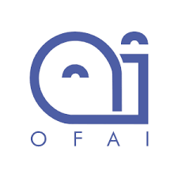

# JokeR

  

[Home](index) | [Project](project) | Partners | [Contact Us](contact) |  
 

## Organizers: 
* **Liana Ermakova (UBO)**
 IT Lecturer (MCF)
 HCTI EA-4249, Department of Humanities and Social Sciences
 [Link to profile](https://www.univ-brest.fr/hcti/menu/Membres/Enseignants-chercheurs/Ermakova--Liana)
 *Project Leader*

* **Benoît Jeanjean (UBO)**
 Latin Professor
 HCTI EA-4249, Department of Humanities and Social Sciences
 [Link to profile](https://www.univ-brest.fr/hcti/menu/Membres/Enseignants-chercheurs/Jeanjean__Benoit)
 *Participant*

* **Gaëlle Le Corre (UBO)** 
 English Linguistics Lecturer (MCF)
 EA 4451 CRBC, UFR ALL SHS, Department of English
 [Link to profile](https://www.univ-brest.fr/crbc/menu/Membres+du+laboratoire/Enseignants-chercheurs/Ga-lle-Le-Corre)
 *Participant*

* **Élise Mathurin (UBO)**
 English Linguistics Lecturer (MCF), in charge of the first-year students of the Technical Writing/Technical Translation master's degree.
 HCTI EA-4249, UFR ALL SHS, Department of English
 [Link to profile](https://www.univ-brest.fr/hcti/menu/Membres/Enseignants-chercheurs/Mathurin--Elise)
 *Participant*

* **Mohamed Saki (UBO)**
 English Linguistics Lecturer (MCF)
 HCTI EA-4249, Department of Humanities and Social Sciences
 [Link to profile](https://www.univ-brest.fr/hcti/menu/Membres/Enseignants-chercheurs/Saki--Mohamed)
 *Participant*

* **Radia Hannachi (UBS)** 
 French Linguistics and French as a Foreign Language Didactics Lecturer
 HCTI EA-4249, Faculty of Arts, Humanities and Social Sciences, "Département Ingénierie du Document"
 *Participant*

* **Sílvia Araújo (University of Minho, Portugal)**
 Associate Professor
 Department of Humanities and Social Sciences
 [Link to profile](http://cehum.ilch.uminho.pt/researchers/25)
 *Participant*

* **Fabio Regattin (Università degli Studi di Udine, Italy)** 
 Department of Language and Literature, Communication, Education and Society
 [Link to profile](https://scholar.google.com/citations?user=6F5BfbIAAAAJ&hl=it)
 *Participant*

* **Tristan Miller (Austrian Research Institute for Artificial Intelligence, Austria)**
 Language and Interaction Technologies Group at OFAI
 [Link to profile](https://logological.org/) 
 *Participant*

## Partners from the SEA-EU universities: 
* **Sergio Portelli (University of Malta)** 
 Associate Professor, Head of Department of Translation
 Department of Translation, Terminology and Interpreting Studies, Faculty of Arts 
 [Link to profile](https://www.um.edu.mt/profile/sergioportelli)
 *Partner university coordinator, specialist in translation*

* **Ġorġ Mallia (University of Malta)**
 Associate Professor
 Media & Communications department, Faculty of Media & Knowledge Sciences
 [Link to profile](https://www.um.edu.mt/profile/gorgmallia)
 *Participant, specialist in humour*

* **Monika Bokiniec (University of Gdansk)** 
 Associate Professor
 Department of Aesthetics and Philosophy of Culture, Faculty of Social Sciences
 [Link to profile](https://ug.edu.pl/pracownik/413/monika_bokiniec)
 *Partner university coordinator*

* *** **Gordan Matas (University of Split)**
 Department of English

## Website maintenance:
* **Adrien Couaillet (UBO)**
 Technical Translation/Redaction Master's Degree's Student
 Department of English

* **Ludivine Grégoire (UBO)**
 Technical Translation/Redaction Master's Degree's Student
 Department of English

  
  
  

 *This project has received a government grant managed by the National Research Agency under the program "Investissements d'avenir" with the Reference ANR-19-GURE-0001.*
