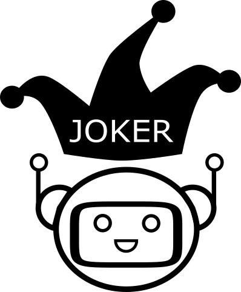

# JokeR

  

[Accueil](index) | Projet | [Partenaires](partenaires) | 
 

## Plus de contenu prochainement.

 *Ce projet a bénéficié d'une aide de l'état gérée par l'Agence Nationale de la Recherche au titre du programme « Investissements d'avenir » portant la Référence ANR-19-GURE-0001.*
